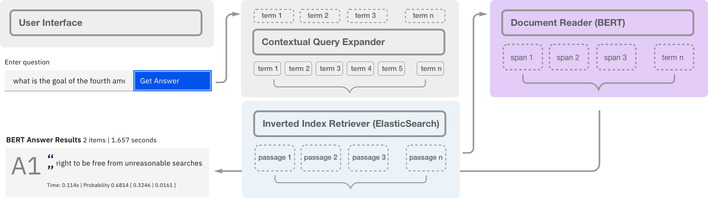

## NeuralQA: Question Answering on Large Datasets with BERT
[](https://opensource.org/licenses/MIT)


 NeuralQA




NeuralQA is an end-to-end application (passage retrieval, document reading, [flexible UI](https://victordibia.github.io/neuralqa/)) for question answering on large datasets. Passage retrieval is implemented using ElasticSearch and Document Reading is implemented using pretrained BERT models via the Huggingface [transformers api](https://github.com/huggingface/transformers). An example query and response using a BERT model is shown below.

```
what is the sentence for arson crime?
```

```
BERT Answer: [1.01s] 18 years ’ imprisonment, but mitigated the sentence to 12 years because “ Defendant did not have any intent to injure the victim. ” See NMSA 1978, § 31 - 18 - 15. 1 ( 1979, as amended in 1993 ) ( allowing for mitigation of up to one - third of sentence, [0.26s] shooting at or from a motor vehicle
```

The question answering workflow can be broken down into two main parts: 

- Candidate document retrieval : retrieve a list of top `n` documents based on the search question/query. 
- Document reading: identifying portions of each text that may contain an answer to the query.

### What does NeuralQA Do?
Do you have large dataset of documents for which you would like to extract answers? NeuralQA leverages state of the art deep learning models (BERT) to help you achieve this. It does the following

- Document Import 
    - documents into a search index (ElasticSearch)
    - Automatically segment large documents into smaller segments
- Passage Retrieval
    - For each search query, scan index, retrieve matched passages
    - Optionally construct new passages from retrieved highlights
    - Optionally apply contextual query enrichment  
- Launch a user interface that allows you to perform search queries


## Candidate Document Retrieval
For this task, we will use elastic search (mostly for its clean python api, ease of use). Elasticsearch is a search engine based on the Lucene library. It provides a distributed, multitenant-capable full-text search engine with an HTTP web interface and schema-free JSON documents. Other alternatives include Solr (also based on Lucene).

Elastic search uses the `BM25` algorithm by default for implementing similarity between text fields. We will also use the elastic search python client for elastic operations (create index, search queries).

## Document Reader
To identify an answer span, we will use a set of BERT based question answering models pretrained on both the SQUAD1 and SQUAD2 datasets. Ideally, this provides some benchmark on how well a pretrained model works for domain corpus such as legal/court documents.


## Getting Started

#### Install & Launch Elastic Search

Follow the [instructions here](https://www.elastic.co/downloads/elasticsearch) to download, install, and launch elastic search.

> Note - Be sure to launch an Elasticsearch node by running its binary script found in the /bin directory. 

#### Create a Virtual Environment

Isolate and reproduce project dependencies by creating a virtual environment using Anaconda.

```bash
conda create python=3 -n qa-env
conda activate qa-env
pip install -r requirements.txt
```

> Note - Using Anaconda to manage environment and pip to manage packages to ensure latest versions are available

#### Build Web Application

Run the web application UI that allows the user to interactively ask questions and review responses from the IR + DR pipeline.

##### Build Front End

Create an optimized build for the front end (shown above) and copies it to the build folder. The backend web application serves this UI from the build folder.

```shell
cd ui
npm install
npm run build
```
##### Launch Back End

Launch a Flask application to serve the UI.

```shell
python3 app.py
```


 